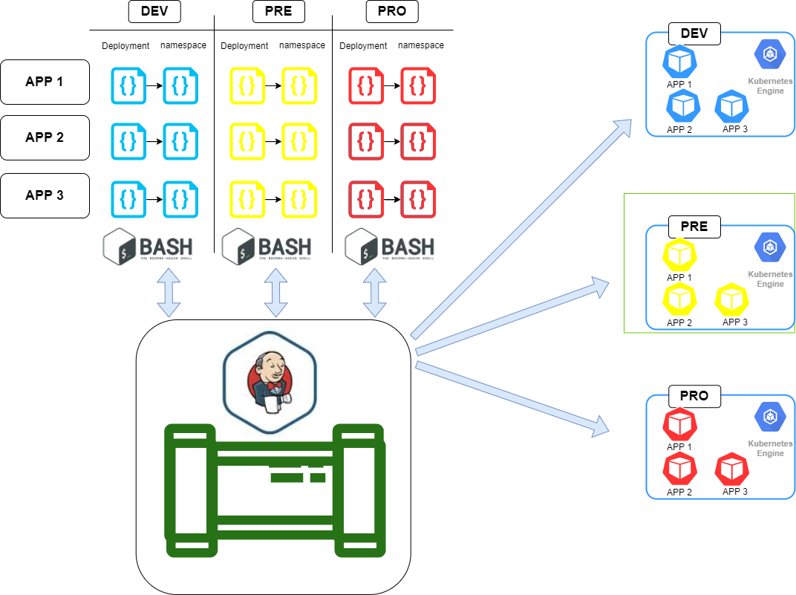
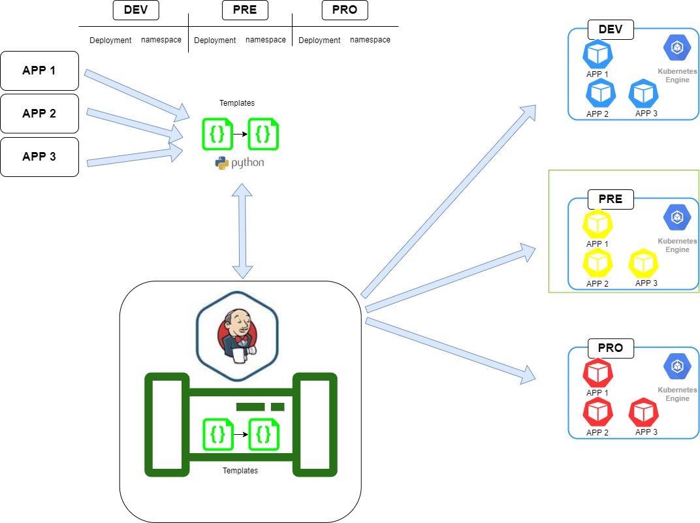

# # Curso de JENKINS - Templates y Kubernetes 

En este video aprenderemos una buena práctica, mejor dicho un pilar dentro de los automatismos que podremos aplicar a todos nuestros automatismos.
Comenzaremos con el concepto de templates o plantillas dentro de los automatismos, que trata basicamente de reutilizar condigo que se repite constantemente.

Dandonos como ventaja un menor tiempo de creacion de aplicaciones, mantenimiento y puntos de fallo en el codigo.

Un claro ejemplo son los deployments, namespaces, services en kuberntes, que sin ficheros .yaml con la misma estructura, por dar un punto de partida.
Para dar un escenario grafico comentaremos un caso donde tenemos que realizar un cambio en un despliegue de una aplicacion o componente y observamos que hay 3 aplicaciones que se despliegan en 3 entornos, DEV,PRE y PRO, donde cada variante requiere de sus archivos yaml con codigos repetidos y sin variables ( comunmente llamado "valores puestos a fuego" ).
Esto nos deja la siguiente cantidad de ficheros en caso de tener deplyments y services.

3 deployment + 3 services * 3 entornos = 18 ficheros para mantener 




Al finalizar dejaremos los codigos optimizados de tal forma que solo tengamos un total de 2 ficheros templates para el caso anterior.
El mismo se confeccionara con Python 3 el cual no es indispensable pero ya que estamos aprovechamos para utilizar un lenguaje mas amigable y potente.




### concepto

- directorio
  -- templates
   | -- template-deployment.yaml
- script.py
- resultado-deployment.yaml

### Codigo minimo 

```
#!/usr/bin/env python3
import sys, shutil, os
from jinja2 import Template, Environment, FileSystemLoader


# variables
aplication = sys.argv[1]
label_app = sys.argv[2]
origen = 'templates/template-deployment.yaml'
destino = aplication + "-deployment.yaml"

# Configuracion y reemplazo de valores
env = Environment(loader=FileSystemLoader('')) # carpeta de template vacia
template = env.get_template(origen) # template
output_from_parsed_template = template.render(
    name_app=aplication,
    label_app=label_app
)

# Print contenido modificado
print(output_from_parsed_template)
if not os.path.exists(destino):
    with open(destino, 'w'): pass

# volcado de contenido
f = open(destino,'w')
print(output_from_parsed_template, file=f)
```


### Comandos 
Debug: 

```
python3 -mpdb deployment_dinamic.py arg1 arg2 arg3
```

Run model:

```
python deployment_dinamic.py app_name app_label app_version docker_image docker_name port environment

```

Run:

```
python deployment_dinamic.py "app_web_ideas_extraordinarias" "web_ideas" "v:3.0" "nginx:1.15.4" "nginx" "80" "dev"
```

internal variables: 

```
sys.argv[1] sys.argv[2] sys.argv[3]
```

### Configuración Jenkins 

git            https://github.com/agustinjaume/jenkins-server
jenkinsfile 