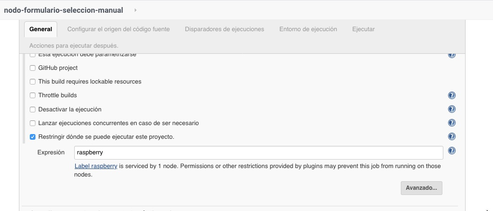

# Curso de JENKINS 

## 13_ Nodos
 
### Nodos Estáticos 

En este video veremos:
Conceptos de Jenkins server y estructura de nodos y cual nos conviene utilizar o se adapta mejor a nuestros objetivos.
Como agregar y administrar nodos estáticos a nuestro Jenkins server.

Aprenderemos como seleccionar los nodos ya sea por formulario o por código.


Escenario con nodos estáticos:
Ventajas : 
- Todos los componentes se desplegaran en nodos que estarán siempre dando servicio, por lo tanto en el mejor de los casos es inmediata la gestión.
Desventajas :
- consumo eléctrico debido a servidores. refrigeración
- Escalado manual
- Administración y dependencia de soporte en mayor grado que opciones dinámicas de nodos.

  

Escenario con nodos dinámicos:

Ventajas : 
- Ahorro de costes, unificación de gastos de refrigeración, mantenimiento de hardware
- Escalado por demanda
- 
Desventajas :
- Delay de despliegue


  

Cotejando ambos escenarios podemos hablar el siguiente cuadro de ejes:


### Agregaremos 2 nodos estaticos 
Componentes necesarios:

- servidores o instancias que funcionaran como nodos.
- acceso ssh a los mismo.


### Opción 1 seleccion manual de nodo en job



### Opción 2 seleccion desde codigo 


Creamos un job con formato pipeline con el siguiente codigo.

```
pipeline {
    agent any
    // agent { label '$NODO' }
    parameters { 
      choice(name: 'Entornos', choices: ['dev', 'pre', 'pro'], description: 'Seleccione el entorno a utilizar')
      choice(name: 'Nodo', choices: ['', 'raspberry', 'ubuntu19', 'windows','python27','alpine'], description: 'Seleccione el entorno a utilizar')
    }
    stages {
        stage('Build') {
        agent { label "${params.Nodo}" }
            steps {
                sh "echo Construyendo.."
                sh "touch prueba'${params.Nodo}'.txt"
            }
        }
    }
}

```

-


