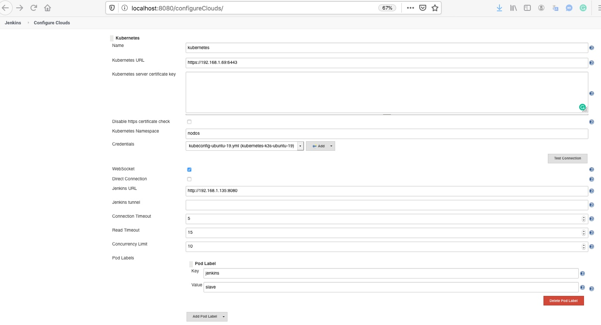
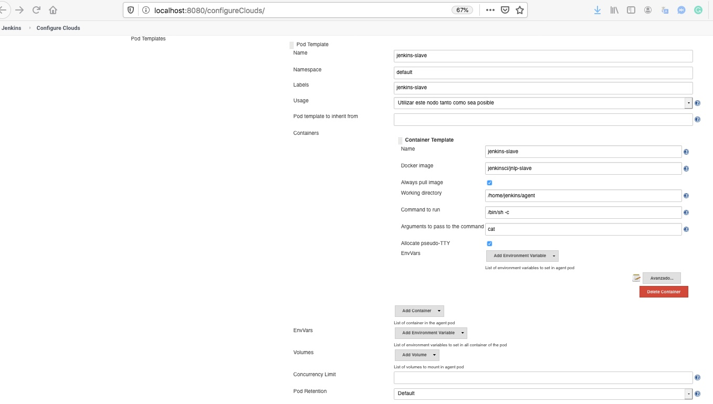

# Curso de JENKINS 

## 13_ Nodos
 
### Nodos dinamicos

En este video veremos el concepto de funcionamiento para tener un escenario real.

  

- Verificaremos la existencia del nuestro recurso con Kubernetes en nuestro caso usaremos un K3s ya que cuenta con un diseño minimalista y totalmente limpio por parte del equipo de Rancher.  https://k3s.io/

Instalación:

```
curl -sfL https://get.k3s.io | sh -
k3s kubectl get node
```
Verificación de conexión desde un ordenador al nodo de Kubernetes.

```
kubectl cluster-info
kubectl get nodes
kubectl describe node linux2
```

- Obtendremos las credenciales para poder conectarnos remotamente con "kubectl"

```
sudo k3s kubectl config view --raw
```

- Guardaremos el kubeconfig en nuestro ordenador para poder hacer seguimiento y gestionar el cluster independientemente de Jenkins ( este paso se recomienda aunque no es obligatorio ) y exportaremos el kubeconfig con el comando:

```
export KUBECONFIG=/Users/xxxxxx/k3s/kubeconfig-ubuntu-19.yml
```

- Como configurar nuestro Jenkins master con Kubernetes 

Comenzaremos por configurar el servidor master sin la propiedad de ser un nodo Jenkins 
Gueardar nuestras credenciales de conexión kubeconfig en la sección de "Credentials" de Jenkins
Iremos a "Administrar Jenkins"  --> "Administrar Nodos" -->  "Configure Clouds"

  

 


- Ejecutaremos un pipeline con Jenkinsfile en los nodos Jenkins de Kubernetes


```
pipeline {
  agent {
    kubernetes {
      yaml """
apiVersion: v1
kind: Pod
metadata:
  labels:
    some-label: some-label-value
spec:
  containers:
  - name: maven
    image: maven:alpine
    command:
    - cat
    tty: true
  - name: busybox
    image: busybox
    command:
    - cat
    tty: true
"""
    }
  }
  stages {
    stage('Run maven') {
      steps {
        container('maven') {
          sh 'mvn -version'
        }
        container('busybox') {
          sh '/bin/busybox'
        }
      }
    }
  }
}

```


- Visualizacion de generacion de los nodos Jenkins y su posterior eliminacion automatica, esto lo haremos desde el terminal de nuestro ordenador o desde propio nodo de Kubernetes, lo dejo a vuestro gusto.

```
kubectl get po -n default -o wide -w
```
