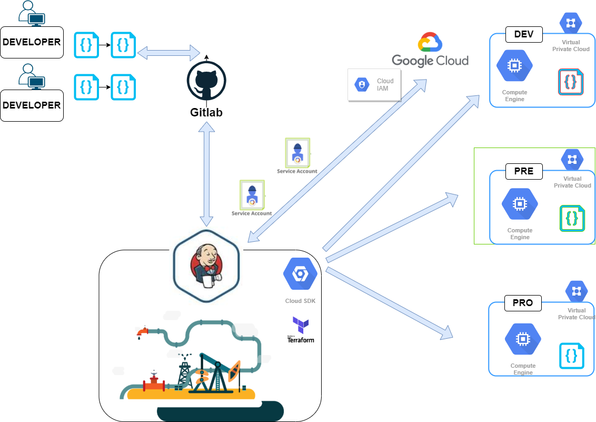
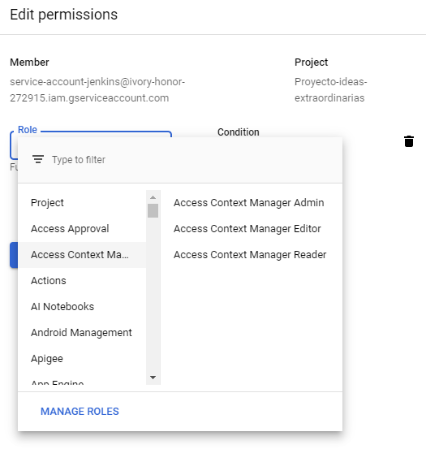
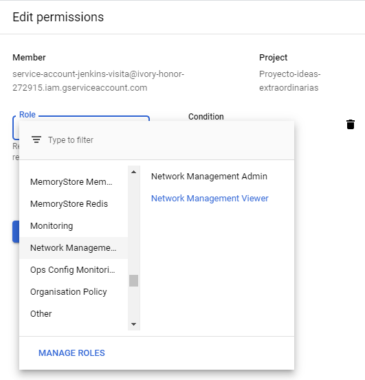

# Curso de JENKINS - Conexión y gestión con Google Cloud

En este video una buena práctica para poder conectarnos a nuestra respectiva nube y proyecto en la nube Google.
Tambien os contare una práctica que encontré configurada en el pasado  y no recomiendo por temas de seguridad, evaluaremos sus pros y contras




### Componentes necesarios 

- Cuenta en GCP ( free tier) o con saldo suficiente para hacer estas pruebas
- 2 cuentas de servicio 
  - service-account-total-control Network Management Viewer   Read-only access to Network Management resources.
  - service-account-view-network  Owner      Full access to all resources.
- Jenkins server y conceptos de pipelines
- Código de Pipeline declarativo


#### Cómo creamos una cuenta de servicio

¿Qué son las cuentas de servicio?
Una cuenta de servicio es un tipo especial de cuenta que usa una aplicación o una instancia de máquina virtual (VM), no una persona. Las aplicaciones usan cuentas de servicio para realizar llamadas a la API autorizadas.

1. Entramos al panel web de GCP
2. Luego accedemos por el menú superior hasta IAM & admin
3. Service Accounts
4. Presionamos boton superior de "+ CREATE SERVICE ACCOUNT" Asignamos permisos similares a estos 






https://cloud.google.com/iam/docs/creating-managing-service-accounts?hl=es

###  Comandos que utilizaremos una vez conectados a la nube


```
  gcloud projects list
  gcloud compute instance-groups list-instances
  gcloud app instances list
  gcloud bigtable instances list
  gcloud compute instances list
  gcloud filestore instances list
  gcloud redis instances list
  gcloud spanner instances list
  gcloud sql instances list
  gcloud compute instance-groups list

```


### Pipeline que usaremos 


```
pipeline {
    agent any
    options {disableConcurrentBuilds()}
    environment {
        GOOGLE_PROJECT_ID = "ivory-honor-272915" 
        GOOGLE_PROJECT_NAME = "Proyecto-ideas-extraordinarias"
        GOOGLE_APPLICATION_CREDENTIALS = credentials('service-account-jenkins-visita')
        GOOGLE_CLOUD_KEYFILE_JSON = credentials('service-account-jenkins-visita')
    }
    
    stages{
        
        stage('clean workspaces -----------') { 
            steps {
              cleanWs()
              sh 'env'
            } //steps
        }  //stage

        
        stage("Google Cloud connection -----------------"){
            steps {
                
                sh("gcloud auth activate-service-account --key-file=${GOOGLE_APPLICATION_CREDENTIALS}")
                sh 'gcloud config set project ${GOOGLE_PROJECT_ID}'
                sh '''
                  gcloud compute networks list
                  gcloud projects list
                  
                '''
            } //steps
        }  //stage
   }  // stages
} //pipeline

```
