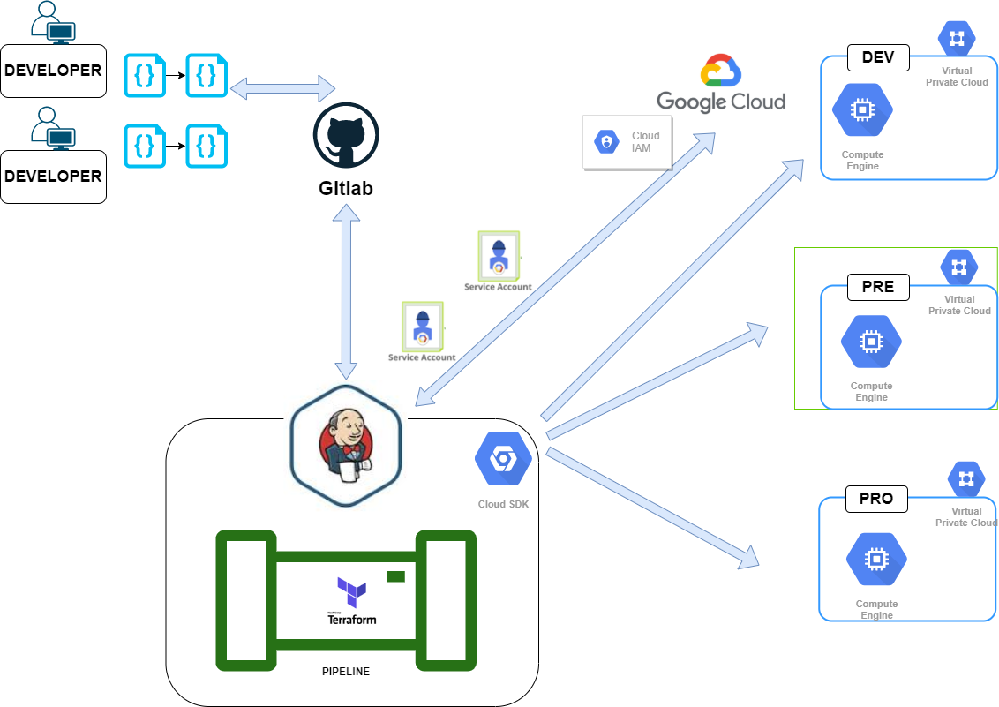

# Curso de JENKINS - Terraform y Google Cloud

En este video realizaremos el despliegue de infraetructura como codigo con ayuda de Terraform, en un proyecto de google cloud.
Es recomendable ver el video anterior de "Conexion con Google Cloud desde Jenkins" que podras encontrar en la lista de videos publicados de Jenkins.



### Terraform con google cloud 

https://www.terraform.io/docs/providers/google/guides/getting_started.html

Para podes desplegar infraestructura como codigo desde nuestros ordenadores o instancias mecesitaremos asignarle credenciales.
En nuestro caso asignaremos el contenido del fichero que contiene nuestro service_account.json en la variable de entorno GOOGLE_APPLICATION_CREDENTIALS

```
export GOOGLE_APPLICATION_CREDENTIALS={{path}}
```

### Componentes necesarios 

- Cuenta en GCP ( free tier) o con saldo suficiente para hacer estas pruebas
- 1 cuentas de servicio 
  - service-account-terraform-vm   con permisos para realizar despliegues en "compute Engine"
- Jenkins server y service Account configurado en Credenciales .
- Jenkins server con Terraform instalado 
- Conceptos de pipelines
- Código de Pipeline declarativo 
- Código de terraform en repositorio externo.


### Pipeline que usaremos 

```
pipeline {
    agent any
    options {disableConcurrentBuilds()}
    environment {
        GOOGLE_PROJECT_ID = "ivory-honor-272915" 
        GOOGLE_PROJECT_NAME = "Proyecto-ideas-extraordinarias"
        GOOGLE_APPLICATION_CREDENTIALS = credentials('sc_jenkins_terraform')
        GOOGLE_CLOUD_KEYFILE_JSON = credentials('sc_jenkins_terraform')
    }
    parameters { 
      choice(name: 'ENTORNOS', choices: ['dev', 'pre', 'pro'], description: 'Seleccione el entorno a utilizar')
      choice(name: 'ACCION', choices: ['', 'plan-apply', 'destroy'], description: 'Seleccione el entorno a utilizar')
    }
    stages{
        
        stage('clean workspaces -----------') { 
            steps {
              cleanWs()
              sh 'env'
            } //steps
        }  //stage

        //${params.Acción}
        stage("git clone code terraform"){
            steps {
                cleanWs()
                    checkout([$class: 'GitSCM', 
                    branches: [[name: '*/master']], 
                    doGenerateSubmoduleConfigurations: false, 
                    extensions: [[$class: 'CleanCheckout']], 
                    submoduleCfg: [], 
                    userRemoteConfigs: [
                        [url: 'git@github.com:agustinjaume/jenkins-terraform.git', credentialsId: '']
                        ]])
                sh 'pwd' 
                sh 'ls -l'
            } //steps
        }  //stage
    
        stage('Terraform init----') {
         steps {
            sh 'terraform --version'
            sh ' cd bastion && gcloud projects list'
            sh ' cd bastion && terraform init -var-file="../variables/dev.tfvars" '
            } //steps
        }  //stage

        stage('Terraform plan----') {
            steps {
               sh 'cd bastion && terraform plan  -refresh=true  -var-file="../variables/dev.tfvars" -lock=false'
            } //steps
        }  //stage
        
        stage('Confirmación de accion') {
            steps {
                script {
                    def userInput = input(id: 'confirm', message: params.ACCION + '?', parameters: [ [$class: 'BooleanParameterDefinition', defaultValue: false, description: 'Apply terraform', name: 'confirm'] ])
                }
            }
        }
        
        stage('Terraform apply or destroy ----------------') {
            steps {
               sh 'echo "comienza"'
            script{  
                if (params.ACCION == "destroy"){
                         sh ' echo "llego" + params.ACCION'   
                         sh 'cd bastion && terraform destroy -var-file="../variables/dev.tfvars" -auto-approve'
                } else {
                         sh ' echo  "llego" + params.ACCION'                 
                         sh 'cd bastion && terraform apply -refresh=true -var-file="../variables/dev.tfvars"  -auto-approve'  
                }  // if

            }
            } //steps
        }  //stage
   }  // stages
} //pipeline

```
