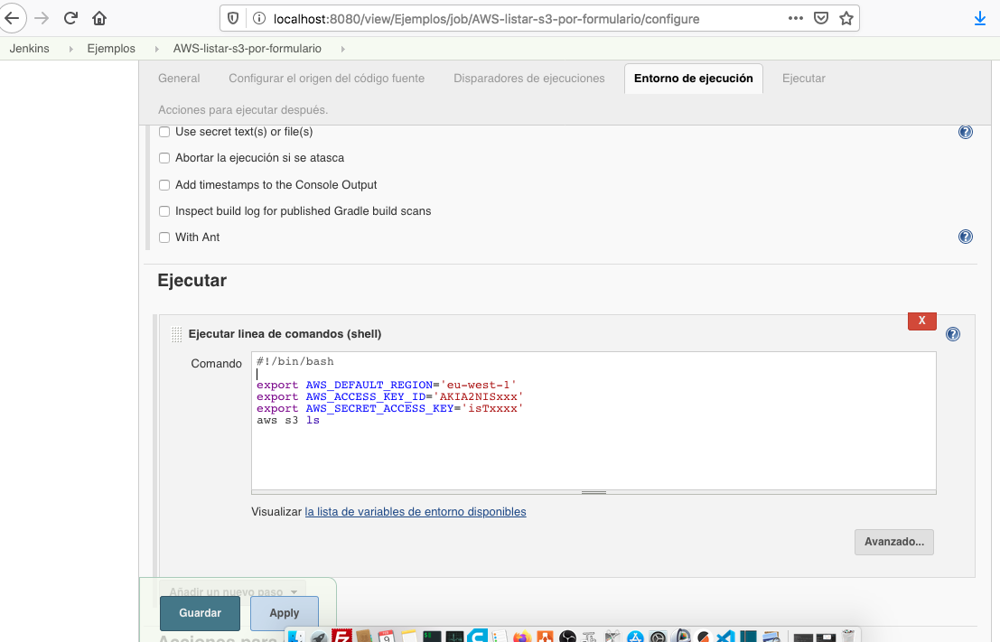

# Curso de JENKINS - Primeros paso


Ya tenemos el servidor instalado y ahora que, veamos las opciones que tenemos sobre la mesa :

1_ Comenzamos a copiar scripts como espartano asalvajado  y mientras funcione ya somos cumplimos nuestro deber ciudado .


2_ Nos detenemos a evaluar las opciones que mejor se adapten a nuestras necesidades y respondan positivamente los siguiente puntos que se me vienen a la mente:

- Podemos unificar todos los automatismos en una misma tecnología ? ( por ejemplo pasar todos los automatismos a Ansible )

- Podemos unificar información sensible como ser claves de acceso de forma segura,  por ejemplo seridor vault, Credentials de Jenkins ,sistema de tercero que nos delegue algún rol operativo y podamos interactuar con el mismo sin comprometer el sistema.?

- Podemos garantizar que no se suben credenciales en claro ?

- Podemos tener definidos los usuarios y los permisos adecuados para desplegar en los diferentes entorno ?


- Nuestra solución facilita el trabajo de otros departamentos o tenemos que consensuar metodologías para dar un grado mas de calidad y seguridad ( por ejemplo con el departamento de QA ).


- En caso de " desastre con Jenkins" cuanto se tarda en volver a dejar operativos los pipelines.


- Cuanto tiempo supone implementar estos cambios y si los tiempos cuadran con la estrategia de negocio.


---------------------------------------------------------------------------------------------------------------

Opciones de como encarar la nueva implementación para pode descargar código, compilar, test, desplegar, etc mediante codigo:


## 2_a   Pipelines con formulario
        Esta opciones es buena para aprender la logica de funcionamiento y realizar tareas simples, las buenas practicas nos llevan 
        a trabajar como codigo cada job o pipeline con los beneficios que ello nos trae. Asi y todo lo veremos para tener un comienzo amigable

        

```
 #!/bin/bash
export AWS_DEFAULT_REGION='eu-west-1'
export AWS_ACCESS_KEY_ID='AKIxxxxxxxx'
export AWS_SECRET_ACCESS_KEY='xxxxxxxxx'
aws s3 ls  
```

## 2_b   Pipelines con jenkinsfile declarativos 
          Documentación oficial:  https://jenkins.io/doc/book/pipeline/syntax/ 

```
pipeline {
agent any 
environment {
   AWS_DEFAULT_REGION = 'eu-west-1' 
}
stages{ 
    stage('deploy') {
      steps { withCredentials([[
        $class: 'AmazonWebServicesCredentialsBinding', 
        credentialsId: 'aws-jenkins-server', 
        accessKeyVariable: 'AWS_ACCESS_KEY_ID', 
        secretKeyVariable: 'AWS_SECRET_ACCESS_KEY'
        ]]) 
        {
        sh 'aws --version' 
        sh 'aws s3 ls' 
       // sh 'aws ec2 describe-instances'
    } }
} 
} 
}
```


## 2_c   Pipelines con jenkinsfile desde repositorio

Subimos el pipeline anterior dentro de un archivo llamado '1_Jenkinsfile_connect_and_list_s3_bucket.jenkinsfile' 
Desde un nuevo Job creado como "Pipelines" lo llamamos segun la siguiente configuracion:


 ## 2_d   Pipelines con groovy


