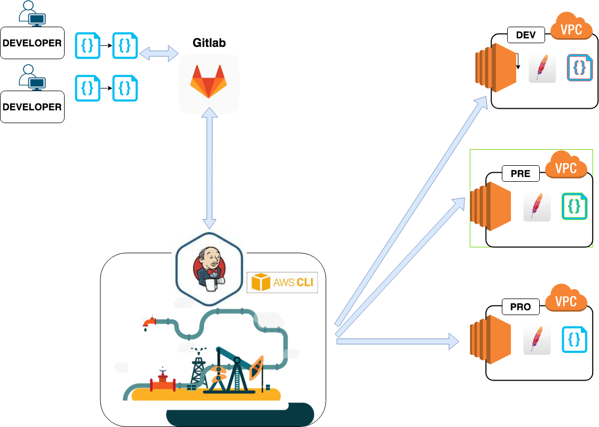

# Curso de JENKINS - Conectarnos con recursos AWS

En este caso nos conectaremos utilizando pipelines declarativos, credenciales y el cliente aws que se encuentra en el servidor Jenkins.




## Repasamos conceptos

### Documentacion oficial : https://jenkins.io/doc/book/pipeline/syntax/

### Ejemplo de estructura tipo


pipeline {                        // Identificamos donde comienza y donde termina nuestro pipeline

agent any                         //  Especificamos en que nodos disponibles queremos ejecutarlo por ejemplo docker { image 'node:7-alpine' }

environment {                     // configuración de variables de entorno 
}

stages{                           // Bloque donde se definen una serie de estados a realizar dentro del pipeline.   

    stage('deploy') {             // Bloque que permite segmentar en tareas nuestro objetivo, si falla alguna el stage se mostrara en rojo 
      steps {                     // Tareas a realizar 
        
        }                         //  fin de steps
      }                           //  fin de stage
    }                             //  fin de stages
post { always { echo 'hola!' } }  //  ocurre siempre, ya sea con resultado always, success o failure
}                                 //  fin de pipeline


## 4_a   Pipelines con jenkinsfile declarativos 
          Documentación oficial:  https://jenkins.io/doc/book/pipeline/syntax/ 

```
pipeline {
agent any 
environment {
   AWS_DEFAULT_REGION = 'eu-west-1' 
}
stages{ 
    stage('deploy') {
      steps { withCredentials([[
        $class: 'AmazonWebServicesCredentialsBinding', 
        credentialsId: 'aws-jenkins-server', 
        accessKeyVariable: 'AWS_ACCESS_KEY_ID', 
        secretKeyVariable: 'AWS_SECRET_ACCESS_KEY'
        ]]) 
        {
        sh 'aws --version' 
        sh 'aws s3 ls' 
       // sh 'aws ec2 describe-instances'
    } }
} 
} 
}
```
## 2_c   Pipelines con jenkinsfile desde repositorio

Subimos el pipeline anterior dentro de un archivo llamado '1_Jenkinsfile_connect_and_list_s3_bucket.jenkinsfile' 
Desde un nuevo Job creado como "Pipelines" lo llamamos segun la siguiente configuracion:


