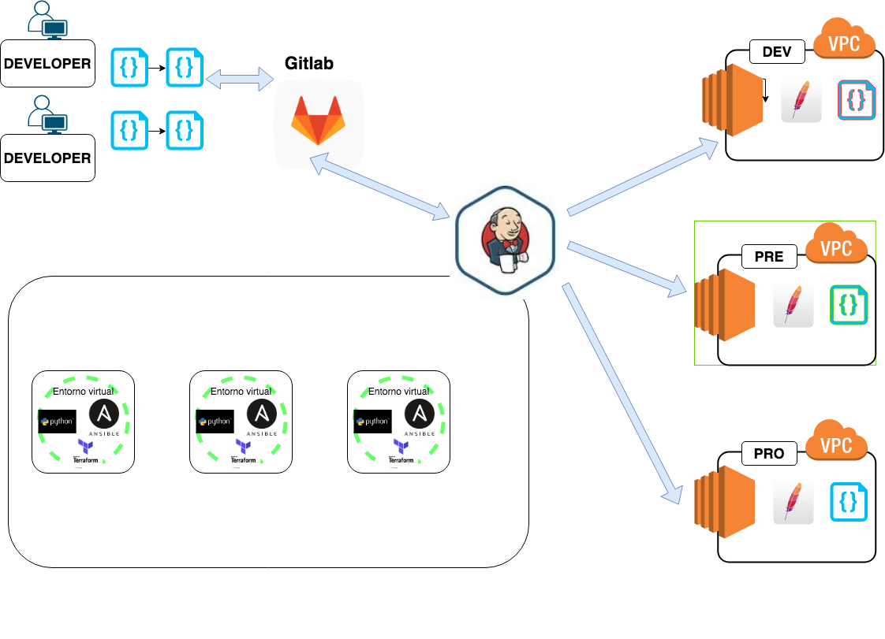
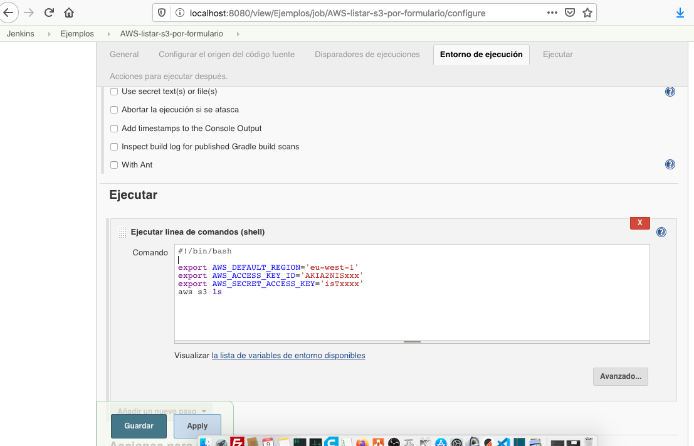

# Curso de JENKINS 

## 7_ Pipeline con virtualenv y Ansible en sus diferente versiones 

En este video veremos como realizar una tarea tan demandada como ser trabajar con entornos virtuales durante es despliegue de una aplicación.

Esta acción la podemos realizar de forma estática y cada despliegue sera un mundo diferente o de forma dinámica que sera la propuesta que les voy a mostrar, para automatizar pipelines de tal forma que nos permite desplegar componentes con diferentes versiones de tecnologías o librerías. 

En un escenario ideal todos los componentes tendrían que ser  desplegados con lenguajes con las ultimas versiones y nodos de Jenkins en las mismas condiciones.

  

La realidad es muy posible que no lo sea y tengamos algunos de estos puntos en común:

- Componentes con lenguajes en sus diferentes versiones 
- Nodos de Jenkins con al menos una de version de cada componente
- Necesidad de estar en conocimiento o documentación de cada componente y sus diferencias entre versiones, para que en caso de tener que realizar un cambio en el despliegue se pueda hacer en el menos tiempo posible.

  


Teniendo en cuenta dicho panorama y para entenderlo mejor  vamos a quitarle complejidad llevando los requerimientos del automatismo a una simple lista componentes necesarios y comenzaremos a darle forma con un ejemplo: 

- Requerimientos de nuestra aplicación

    - ansible 2.5
    - boto

- Deploy de nuestra aplicacion desde local

```
ansible-playbook playbooks/miaplicacion/main.yml -i inventory/pre/
```

- Pasos a seguir en local 

```
sudo apt-get install python python-pip virtualenv -y
virtualenv --no-site-packages 2.5.0.prueba
source ansible2.5.0/bin/activate
    pip install ansible==2.5.0
    pip install boto
    ansible all -i localhost, -c local -m ping
deactivate
```

## 7_1 Opciones para utilizar entornos virtuales

A día de hoy tememos un mínimo de dos opciones disponibles que se me vienen a la cabeza para utilizar en Jenkins.

-  Opción rápida, utilizar el plugin de Jenkins https://plugins.jenkins.io/pyenv-pipeline/ . 
-  Opción recomendada, realizar el desarrollo por código para no perder el control, ni costumbre sobre los códigos .

## 7_2 Pasamos variables seleccionamos el entorno.

Aprenderemos como crear listas de selección de variables desde pipeline declarativos, pero igualmente recordaremos rápidamente como se realiza de la forma manual en un Job.

## Estilo manual por formulario 

  


## Estilo recomendando

```
pipeline {
    agent any
    parameters { 
      choice(name: 'Entornos', choices: ['dev', 'pre', 'pro'], description: 'Seleccione el entorno a utilizar')
      choice(name: 'VersionAnsible', choices: ['2.5', '2.7', '2.9'], description: 'Seleccione la versión de Ansivle a instalar en el entorno virtual ') 
    }
    stages {
        stage('Impresión de variables seleccionadas') {
            steps {
                echo "${params.Entornos} Entorno!"
                echo "${params.VersionAnsible} Version de ansible!"
            }  // fin de step
        }  // fin de stage
    } // fin de stages
} // fin de pipeline
```


## 7_2 Creamos el entorno virtual e instalamos Ansible según la version que pasamos por parámetro.
       
    

Pipeline final para este video   

```
pipeline { 
agent any 
parameters { 
      choice(name: 'Entornos', choices: ['dev', 'pre', 'pro'], description: 'Seleccione el entorno a utilizar')
      choice(name: 'VersionAnsible', choices: ['2.5.0', '2.7', '2.9.5'], description: 'Seleccione la versión de Ansible a instalar en el entorno virtual ') 
    }
environment {
   VERSION="${ VersionAnsible }" 
   PYTHON_PATH="/usr/bin/python2.7" 
   ANSIBLE_HOST_KEY_CHECKING = 'False' 
}
stages{
  stage("Virtualenv Creación") { 
    steps{
       sh ''' 
       #!/bin/bash 
       pwd
       if [ -d "$VERSION" ]; then 
       echo "existe el directorio"
       rm -r ${WORKSPACE}/$VERSION
       else
       echo " no existe el directorio" 
       fi
       virtualenv --no-site-packages $VERSION
       cd ${WORKSPACE}/$VERSION/bin/
       source activate
       pip install boto
       pip install ansible==$VERSION
       pip install hvac
       pip install "hvac[parser]" 
       ansible --version
       ansible all -i localhost, -c local -m ping
       '''
    } // fin de step 
    }// fin de stage

}// fin de stages
}// fin de pipeline

```


