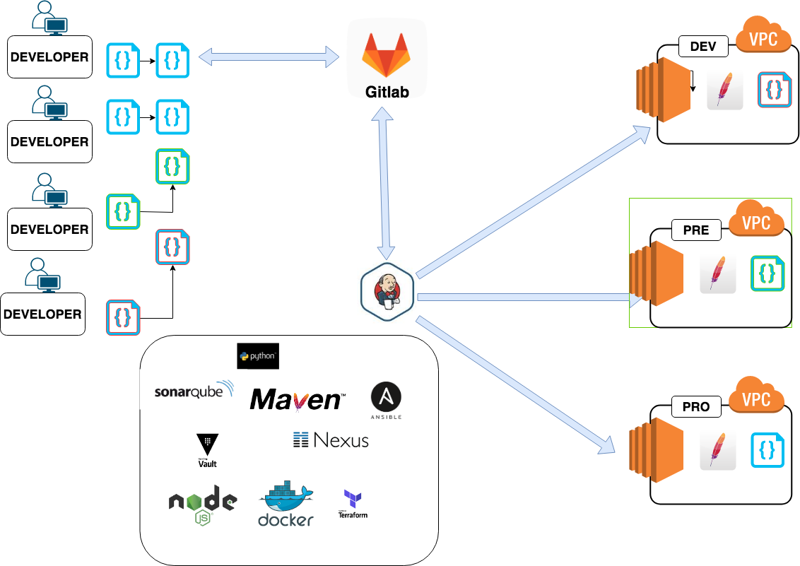
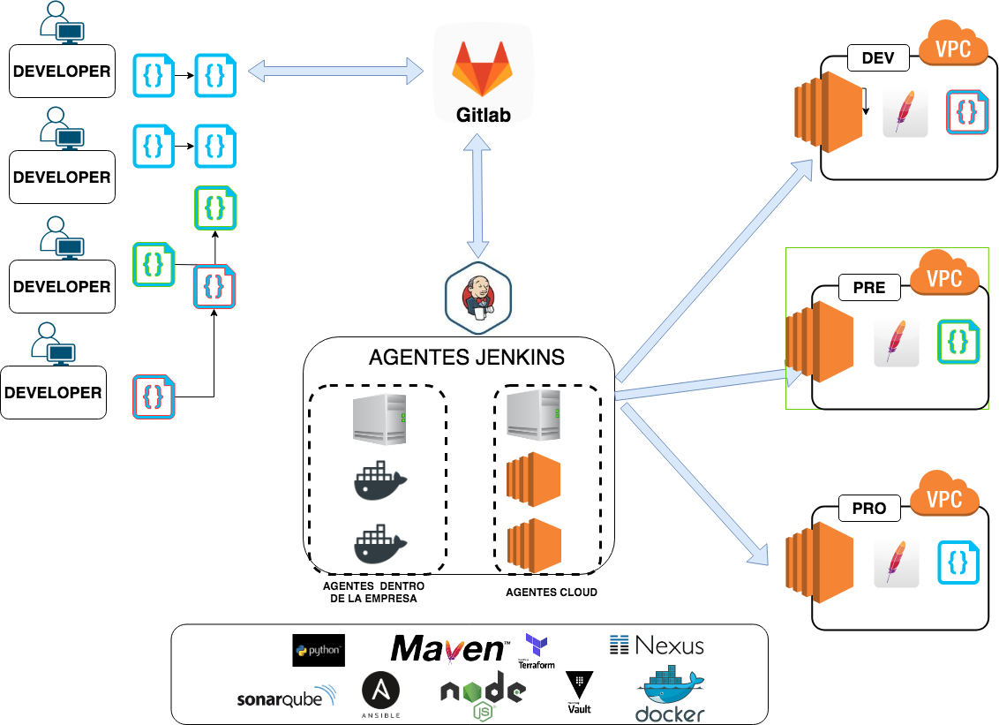

# Objetivo 

En este repositorio encontraremos una copia del repositorio oficial de Jenkins donde,
 personalizaremos la instalacion del mismo para poder reutilizar la misma a futura y aplicar mejoras segun las necesidades.

# Temario

Estará compuesto por una lista de temas en videos cortos que nos permitirán sacar el mayor partido a sus funcionalidades.
La idea es, para ponernos en  contexto un día típico dentro del equipo devops al cual se le asigna tareas diarias y temas de mejora como ser desplegar un servidor de Jenkins para migrar todos los automatismos desde el antiguo sistema de despliegues por motivos de costos y unificación de criterios en los pipelines.

1_ Desplegar un servidor, de ser posible customizado con las librerías o paquetes que  que se utilizan en la mayoría de los proyectos. ( el contenido ya modificado esta en la carpeta /docker del repositorio )


2_ Opciones de como encarar la nueva implementación:
    2_a   Jobs con formulario
    2_b   Jobs con jenkinfile declarativos 
    2_c   Jobs con jenkinsfile desde repositorio
    2_d  Jobs con groovy


3_ Demostrar que podremos conectarnos a todos los recursos involucrados en cada despliegue


4_ Conexion a cloud ( AWS, AZURE o GOOGLE) 


5_ Trabajar con repositorios git que estéis utilizando en vuestra empresa.


6_ Poder seleccionar la rama a desplegar de cada repositorio.


7_ Desplegar diferentes versiones de ansible debido la diferencia histórica de código que no fue actualizado.


8_ Despliegues en servidores on-premise y en instancias cloud


9_ Despliegues por calendario


10_ Despliegues por hooks


11_ Despliegues con Jenkinsfile desde repositorio ( ventajas de este método )


12_ Despliegues con Groovy

# Que es Jenkins y que tan importante es para un Devops.

Jenkins es un sistema que nos permite deplegar componentes de forma
manual, automatica o semi automatica contemplando por ejemplo los siguientes escenarios.

- Programar acciones en el tiempo
- Activacion por script 
- Cambios en un repositorio 

Para un Devops poder contar con una herramienta como Jenkins es vital para centralizar todas las tareas programadas o manuales en un solo sitio, 
contando con un panel donde podremos ver el estado de cada una y mejorarla.

# Esquema logico de la infrastructura de Jenkins

Como recomendacion inicial, en caso de realizar una POC o cuando su utilizacion no requiera de tanto procesamiento seguir el ejemplo de este repositorio nos alcanzara.

En caso de tener gran cantidad de procesamiento, picos de carga, multiples test de cada Jobs, lo recomendable seria tener un master y varios nodos para el procesamiento.

Infraestructura minima 




Infraestructura ideal



# Integración de herramientas y lenguajes que utilizara Jenkins.

Jenkins no hace magia por si solo, necesita de otras herramientas o lenguajes para obtener su maximo rendimiento funcional en la 
Integración, Entrega y Despliegue coninuo como pueden ser :

- Github, Gitlab, Nexus
- Ansible, Terraform
- Vault, Ldap
- Conexiones a recursos cloud
- Python, Bash, Grooby

# Fuente de de Jenkins: 
    https://hub.docker.com/r/jenkins/jenkins/

# Codigo de Jenkins: 
    https://github.com/jenkinsci/docker

# Mejoras a realizar en la imagen

En el archivo Dockerfile realizaremos las mejoras oportunas para ahorrarnos tiempo, si tenemos que repetir el proceso.

```
RUN apt-get update && apt-get upgrade -y && apt-get install -y git curl && curl -s https://packagecloud.io/install/repositories/github/git-lfs/script.deb.sh | bash && apt-get install -y git-lfs && git lfs install && rm -rf /var/lib/apt/lists/*
RUN apt-get update
RUN apt-get install -y  python3
RUN apt-get install -y  python-pip python3-pip
RUN apt-get install -y virtualenv
RUN pip install  cryptography==2.7
RUN pip3 install  cryptography==2.7
RUN apt-get install -y software-properties-common
RUN apt-get install -y awscli
RUN pip3 install ansible==2.5.0
RUN pip3 install hvac
RUN pip3 install boto
RUN echo "root:root" | chpasswd
```


# Creacion de la imagen con las modificaciones 
```
docker build -t "jenkins:vX" .
docker build -t "jenkins:v2223b" .
```

# Desplegar un contenedor con Jenkins server con la imagen previamente desplegada

Ejemplos de como desplegar dos servidores con configuraciones separadas.
```
docker run -d -v jenkins_home_vX:/var/jenkins_home -p 8080:8080 -p 50000:50000 jenkins:vX
docker run -d -v jenkins_home_v2223b:/var/jenkins_home -v /var/run/docker.sock:/var/run/docker.sock -p 8080:8080 -p 50000:50000 jenkins:v2223b
```

* Recordemos los volumenes nos mantienen los ficheros que contienen de forma persistente.
docker volume ls   --->  para listar los volumenes 
docker volume inspect my-vol   --> listar caracteristicas de cada volumen 
```
[
    {
        "Driver": "local",
        "Labels": {},
        "Mountpoint": "/var/lib/docker/volumes/my-vol/_data",
        "Name": "my-vol",
        "Options": {},
        "Scope": "local"
    }
]
```

# Accedemos por http

Accedemos via http al contenedor recien instalado y por unica vez nos pedira la contraseña 
que se encuentra en: 

```
cat /var/jenkins_home/secrets/initialAdminPassword
```

## Creamos el usuario admin

Completamos formulario con datos del nuevo usuario 

# Accedemos al contenedor 

```
docker exec -it c088 /bin/bash
```

# Administracion por terminal 

Cambiamos de usuario para mejoras sobre 
```
su root  --> root
```
Una vez dentro del contenedor con el usuario root podremos instalar paquetes que sepamos que utilizaremos en la mayoria de los casos 
y que no requieras diferentes version, como se nos puede dar el caso con Ansible que resolveremos mas adelante con entornos virtuales.

```
apt install net-tools
```


